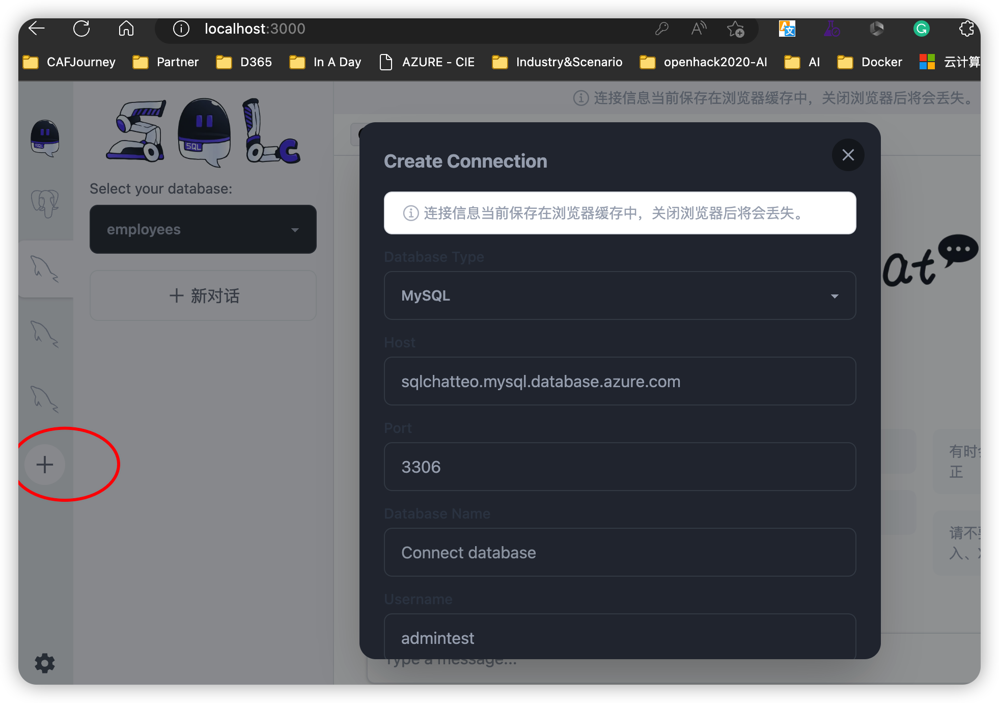

# AzureSQLChatGPTDemo

This is a demo application base on https://github.com/bytebase/sqlchat

更新了如下：
* 修改原始连接器以处理 SSL 连接
* 将大部分页面翻译成中文
* 添加示例 mysql 数据库（Azure MySQL 灵活服务器）连接
* 加载mysql官方示例数据 [employees](https://dev.mysql.com/doc/employee/en/)
* 本Demo使用Azure Openai Service

## 如何在你的本地运行
1. 克隆这个repo：https://github.com/teo-ma/chatgptsql.git
2. 拷贝 .env.example并重命名为 .env，并将里面的openai相关的环境变量替换为你自己的
```bash
    cp .env.example .env

```
3. 安装 pnpm

**On Windows:**
```powershell
iwr https://get.pnpm.io/install.ps1 -useb | iex
```

**On Linux:**
```bash
# bash
wget -qO- https://get.pnpm.io/install.sh | ENV="$HOME/.bashrc" SHELL="$(which bash)" bash -
# sh
wget -qO- https://get.pnpm.io/install.sh | ENV="$HOME/.shrc" SHELL="$(which sh)" sh -
# dash
wget -qO- https://get.pnpm.io/install.sh | ENV="$HOME/.dashrc" SHELL="$(which dash)" dash -
```

4.命令行输入 ```pnpm dev``` 启动本地demo服务
5.打开浏览器，输入 http://localhost:3000/ ，在页面上点击“+”图标，提供了默认的demo数据库连接，也可以添加你自己的数据库连接信息，然后点击“连接”按钮，如果连接成功，就可以开始聊天了。


## 在 Docker 中运行


```bash
docker build -t azure-sql-chat-demo:v1.0 -f ./Dockerfile .
docker run -p 127.0.0.1:3001:3000/tcp azure-sql-chat-demo:v1.0 --env <see .env.example file for environment variables> 
```

## 如何在 Azure App Service 中运行

1. 创建Azure App Service ,Runtime选择NodeJS 18 LTS
2. 最好使用本地测试使用VS Code，VS Code 安装Azure插件和Azure App Service插件。
3. 测试通过后通过插件部署到Azure App Service。
   
4. 成功运行后，在页面上点击“+”图标，提供了默认的demo数据库连接，也可以添加你自己的数据库连接信息，然后点击“连接”按钮，如果连接成功，就可以开始聊天了。
   
   